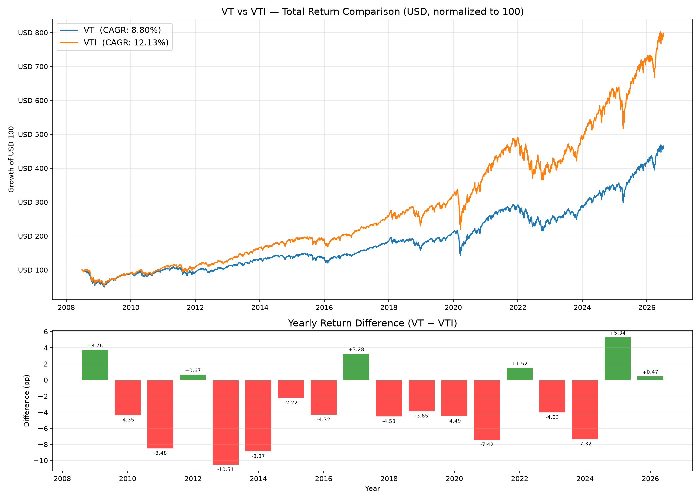

# asset_comparison

Interactive command-line tool to compare the total return of stocks, ETFs or
other assets from Yahoo Finance in a common base currency.

On start it asks for:

1. **Tickers** — two or more Yahoo Finance symbols, separated by comma or
   space (e.g. `ADWI.SW, VT`)
2. **Base currency** — e.g. `CHF`, `EUR`, `USD` (defaults to CHF)

It then downloads the maximum available dividend-adjusted price history,
converts every asset into the base currency using Yahoo FX rates, and plots:

- **Total return comparison** — all assets normalized to 100 at the first
  common date, with the CAGR of each asset in the legend
- **Yearly return difference** (only when comparing exactly two assets with at
  least two full years of overlapping history) — green/red bars showing which
  asset won each year, in percentage points

The chart is also saved as `asset_comparison.png` in the working directory.



## Installation

```
pip install -r requirements.txt
```

## Usage

```
python asset_comparison_tool.py
```

Prices are dividend-adjusted (`auto_adjust=True`), so the comparison reflects
total return, not just price return. Data quality is limited by what Yahoo
Finance provides.
